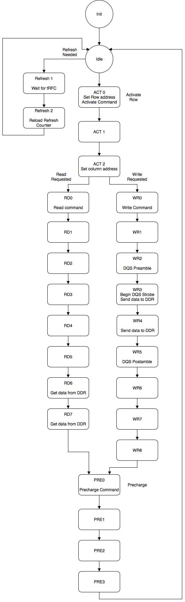

# More Info Later
Initialization is complete

## Usage 
The user visible interface is as follows:
```
    input   [25:0]  c_addr;     // the address to access
    input   [63:0]  c_data_in;  // data input, the ram is 16 bits and each access is a 4 word burst
    output  [63:0]  c_data_out; // data output from ram
    
    input           c_rd_req;   // raise when requesting a read
    input           c_wr_req;   // raise when requesting a write
    
    output          c_rdy;      // ready to service another request
    output          c_ack;      // the pending request has been serviced, and in the case of reads,
                                // the data is available on c_data_out
                    
    input           clk;        // 133+MHz clock input
    input           clk_90;     // 90 degree phase shifted clock input. 
                                // This clock must LAG 'clk' by 90 degrees
    input           rst;        // reset signal
        
```

To perform a read, first wait until `c_rdy` is high, then place an
address on `c_addr` and raise `c_rd_req`. When `c_ack` is high,
deassert `c_rd_req` and the data on `c_data_out` is valid and is the
result of the read.

To perfom a write, first wait until `c_rdy` is high, then place an
address on `c_addr` and some data on `c_data_in` and raise
`c_wr_req`. When `c_ack` is asserted the write has been serviced and
`c_wr_req` can be deasserted.

## Internals

